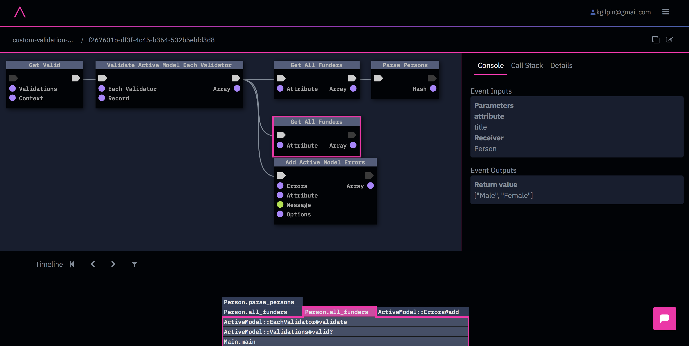

# Custom validation with `validates_each`

Demonstration program for Stack Overflow question https://stackoverflow.com/questions/62637786/custom-validation-with-validates-each

This example demonstrates two behaviors:

1) Custom model validation using `ActiveModel::Validators`.

2) A subtle bug caused by memo-izing the wrong data.

# Code details

## Demonstration of the bug

Note that when the code is fetching the `title` attribute, the returned values are actually `[Male, Female]` (the genders). This is due to the fact that the first call to `get_all_funders` has memoized the result, which will now be returned on each subsequent call regardless of the method parameters.

