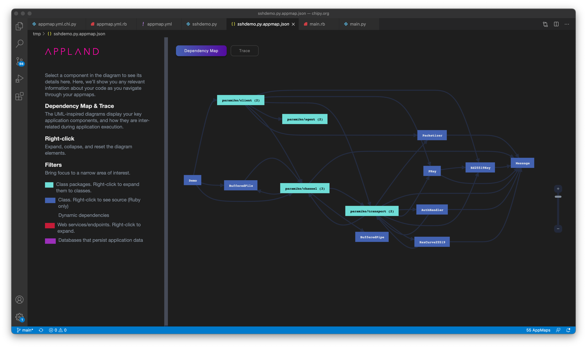
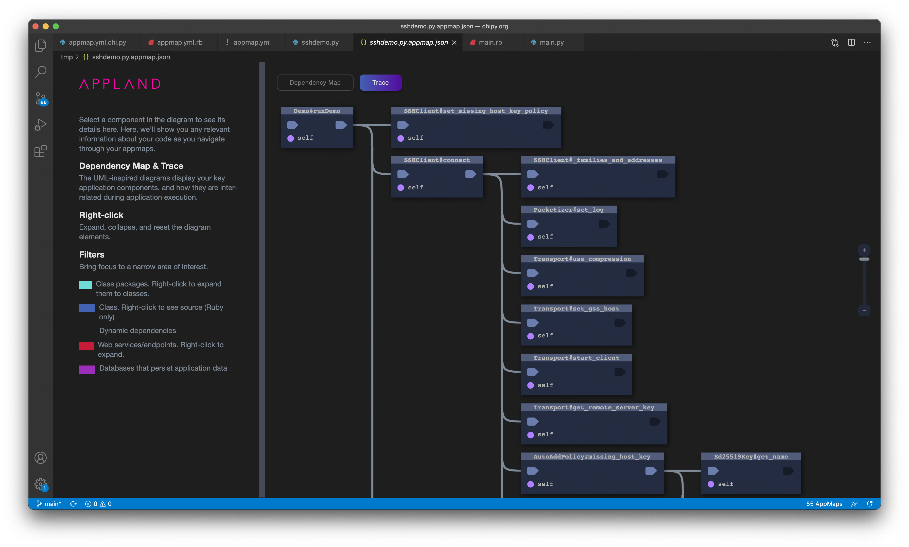
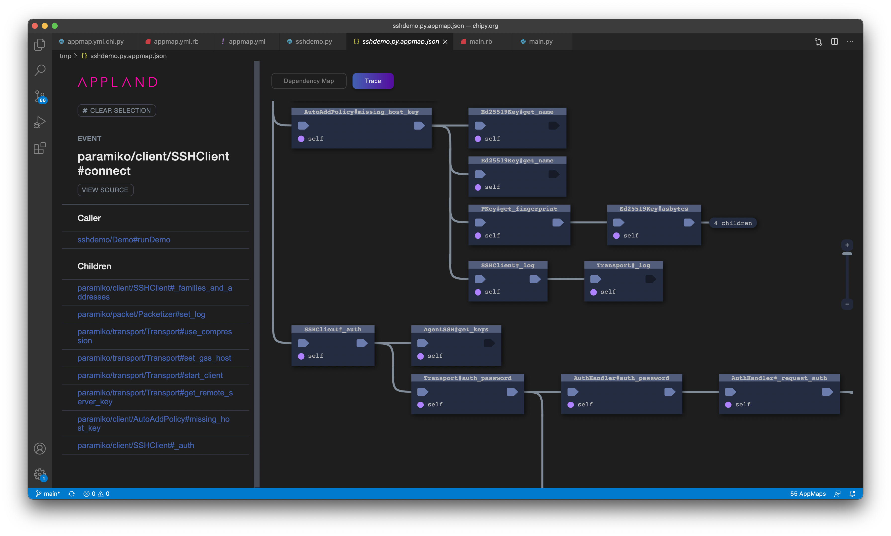

# See how the popular Python SSH client works in AppMap

This demo shows how to visualize how the Python `paramiko` ssh client works with AppMaps.

See the documentation for appmap-python [here](https://github.com/applandinc/appmap-python).

## Install Python packages

Setup your Python3 environment and install these three packages with `pip`:

```shell
% pip install paramiko
% pip install select
% pip install appmap
```

## Configure appmap.yml

The appmap.yml has this content:
```yml
name: main
packages:
- path: sshdemo
- path: paramiko
```

The AppMap recorder will capture all calls of functions in the `sshdemo` and `paramiko` modules.

## Run the demo code and record the AppMap

```shell
% APPMAP=true python main.py
```

The code in `main.py` starts the AppMap recorder, calls the demo code in the sshdemo module and writes the recorded AppMap to diskin the `tmp/` folder.

A pre-recorded example is included for your convenience, see the `sshdemo.py.appmap.json` file.

## See how the SSH client works AppMap

You have two options how to interact with the AppMap files:
1. Install [AppMap for Visual Studio Code](https://marketplace.visualstudio.com/items?itemName=appland.appmap) and open the recorded AppMap file in the IDE:

```shell
% code tmp/sshdemo.py.appmap.json
```

2. Sign-up and upload the AppMap to https://app.land. 

We suggest you start with the Visual Studio Code extension. 

You can now interact with the AppMap diagrams to discover how the SSH client works. Observe the dynamic dependencies between classes and packages in the Dependency Map and the code flow of the `paramiko` implementation in the Trace.


Fig 1. Dependency map



Fig 2. Trace of opening the connection



Fig 3. SSH client implementation flow

## Contact us
Questions or comments? Please [join us on Discord](https://discord.com/invite/N9VUap6).
